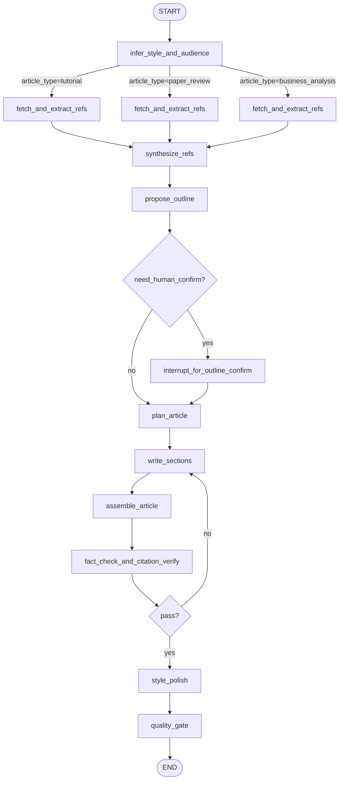

# 优化 OpenJarvis 文章生成质量的深度研究报告

## 执行摘要

本报告基于对 OpenJarvis 仓库核心源码（选题生成、文章生成、LangGraph 编排、RSS 抓取/过滤/翻译、定时推送）与相关官方文档（LangGraph、提示工程、RAG 评估）的审查，定位导致“选题泛化、文章空泛/幻觉、风格不稳定、引用不可信、流程不可验证”的关键技术根因，并给出可落地的改进方案与验证方法。citeturn6view0turn6view2turn12view0turn10view0turn10view1turn13view0turn33search0turn33search7turn33search3

核心结论与建议（按优先级）：

第一优先级是把“文章生成”从当前的**单次大 prompt**（仅给标题+URL）升级为仓库已经具备的**计划驱动分段生成图（LangGraph）**，并补齐两类缺口：  
- **风格/受众自动化与结构化**：把 style/audience 从自由文本升级为“可推断、可解释、可锁定”的 style_profile/audience_profile；在缺省时自动推断，在用户强制选择时锁定。citeturn19view0turn7view0turn10view0turn10view1  
- **可验证性**：把“引用数量”升级为“引用支撑率（faithfulness）+ 事实核查节点 + 自动评估指标”，并将评估数据写入 artifacts/event_logs，形成可 A/B 的闭环。citeturn10view1turn23view0turn33search34turn33search3  

第二优先级是提升“选题生成输入质量与稳定性”：  
- 降低 JSON 任务温度、增加去重/聚类/新颖度后处理、减少 RSS 抽样随机性（当前存在“每源随机 3–5 条”导致输入漂移）。citeturn6view0turn6view1turn15view1turn6view2  

第三优先级是引入可持续的实验体系：离线基准集 + 在线 A/B（邮件点击、站内停留等），用检验方法与样本量估算保证结论可信。citeturn13view0turn33search14  

未指定项与假设：  
- 目标 LLM 未指定：项目当前通过 LiteLLM 适配多提供商（默认 `deepseek/deepseek-chat`），也支持接入 entity["company","OpenAI","ai research company"] 的 API（配置层抽取 provider/model）。citeturn6view0turn6view1turn14view1  
- 用户规模与硬件资源未指定：路线图按“小规模（<1k/日）”“中等规模（1k–50k/日）”“大规模（>50k/日）”提供分档方案（详见实施路线）。citeturn13view0turn10view4  

## 当前实现审查

### 生成系统的两条主路径

仓库中与“文章生成”相关的实现实际上分为两条路径：

路径一是**WritingAssistant（/api/v1/ai）的一次性文章生成**：  
- 选题读取/生成：`app/api/v1/endpoints/ai.py` 的 `/ideas`、`/generate-ideas`，调用 `AIService.generate_topics()`，最终落库 `BlogTopic` 与 `TopicReference`。citeturn19view0turn12view0turn13view0  
- 文章生成：`/generate-article` 调用 `AIService.generate_article()`，其 prompt 主要由 `app/core/prompts/ai_article_prompt.py` 提供（标题+refs URL+style/audience）。该实现**不会抓取参考资料正文**，也不进行分段计划或事实核查。citeturn19view0turn12view0turn7view0  

路径二是**LangGraph 编排的 blog_graph（V2）分阶段生成**：  
- 图定义：`app/orchestration/graphs/definitions/blog_graph.py` 使用 `StateGraph` 串联节点：`fetch -> synthesize_refs -> propose_outline -> interrupt -> plan_article -> write_sections -> assemble_article -> quality_gate`，并支持 `scope_key` 进行单节重跑（load_prior_state）。citeturn10view0turn10view1  
- 节点实现：`app/orchestration/graphs/nodes/blog_nodes.py` 通过 `get_ai_service()` 调用一组 plan/outline/section prompts，并将中间产物保存为 artifacts。citeturn10view1turn12view0turn23view0  
- 编排运行：`GraphRunner`（`app/orchestration/graphs/runtime/runner.py`）执行图；`dispatcher/runner.py` 在 stage 为 `GRAPH_RUN` 时直接执行图并更新 workflow 状态；`orchestration/api/routes.py` 提供创建 workflow、提交 outline 确认、rerun_section 等接口。citeturn10view3turn10view4turn20view0turn22view1  

结论：仓库已经具备“更高质量的计划驱动生成图”，但 WritingAssistant 的 `/generate-article` 仍在走单次 prompt 路径，导致质量上限受限。citeturn19view0turn7view0turn10view0  

### 关键模块与文件清单

下表聚焦你要求的维度：选题、风格/受众、prompt 模板、生成流程、LangGraph、RSS 订阅处理。

| 领域 | 关键文件/模块 | 核心职责 | 关键调用点（概览） |
|---|---|---|---|
| 全局配置 | `app/core/config.py` | AI 模型、温度、max_tokens、RSS 定时、选题开关、编排策略开关（Graph vs legacy stage flow） | `settings.AI_TEMPERATURE=1.0`、`ORCHESTRATION_USE_LEGACY_STAGE_FLOW` 等 citeturn6view0 |
| LLM 统一客户端 | `app/core/ai/client.py` | 基于 LiteLLM 的 chat / stream，支持温度、max_tokens、fallbacks | `AIService.ai_client.chat()`；LangGraph 节点通过 AIService 间接调用 citeturn6view1turn12view0 |
| 选题生成 | `app/core/ai/topic_generator.py` | 将 RSS/平台新闻整理为 `news_content`，调用选题 prompt，解析 JSON 生成 `BlogTopic` 列表 | `/api/v1/ai/generate-ideas` → `AIService.generate_topics()` → `BlogTopicsGenerator.generate()` citeturn6view2turn19view0turn12view0 |
| 写作风格/目标人群 | style/audience 作为字符串贯穿 state/request；默认值为“专业报告/技术从业者” | LangGraph 节点缺省时注入默认 `style`/`audience`；WritingAssistant 由前端请求传入 | `blog_nodes.propose_outline()` / `plan_article()` / `write_sections()` 的默认值；`/generate-article` 请求体字段 citeturn10view1turn19view0 |
| Prompt 模板 | `app/core/prompts/*` | topics/outline/plan/section/refs_synthesis/article/interpret/translation | 通过 `importlib` 动态加载模块 `TEMPLATE`；文章 prompt 模块名可配置 citeturn5view2turn12view0turn6view3turn6view4turn7view1 |
| LangGraph 图定义 | `app/orchestration/graphs/definitions/blog_graph.py` | 定义状态字段与节点/边；支持 conditional start（scope_key） | `StateGraph(BlogState)` + `add_node/add_edge/add_conditional_edges` citeturn10view0turn33search0turn33search16 |
| LangGraph 节点 | `app/orchestration/graphs/nodes/blog_nodes.py` | 抓取 refs → 合成 key_points → 产出 outline → 等待确认 → plan → 分节写作 → assemble → quality_gate | `fetch_url()`、`AIService.generate_blog_outline/plan_article/generate_blog_section()` citeturn10view1turn16view0turn12view0 |
| 工作流运行与人机交互 | `orchestration/api/routes.py`、`graphs/runtime/*`、`dispatcher/runner.py` | workflow/stage_run 管理、事件、产物、outline_confirm/rerun_section | `WaitUserException` 触发 WAITING_USER；用户 action 再触发 GRAPH_RUN 重跑 citeturn20view0turn10view2turn10view3turn10view4 |
| RSS 抓取/解析 | `app/core/crawler/parser.py`、`app/core/crawler/fetcher.py`、`app/services/crawler_service.py` | feedparser 解析、并发抓取、按新鲜度过滤、翻译标题、关键词过滤、入库 | `/feed/fetch` 触发抓取；scheduler 每日任务也可触发抓取 citeturn15view2turn15view1turn15view0turn19view2turn13view0 |
| RSS 过滤 | `app/services/filter_service.py` | 负向词剔除 + 领域分桶（必选词/正向词/负向词）+ 信任源保留 | crawler_service Step5 调用 `two_phase_pipeline()` citeturn15view0turn14view0 |
| 定时推送 | `app/services/scheduler_service.py` | APScheduler cron：抓取→生成选题→推送邮件/飞书；支持 DB 缓存与测试模式 | `run_digest_job()` 复用 `fetch_all_active_feeds()` 与 `AIService.generate_topics()` citeturn13view0turn15view0turn12view0 |
| 网页抓取摘要 | `app/core/fetch_webpage.py` | 单 URL 抓取，正则抽 title，粗略抽 body text 截断 | LangGraph `fetch_and_extract_refs` 使用 `fetch_url()` 提供 ref_cards.summary citeturn16view0turn10view1 |

### 端到端调用流程梳理

典型“每日推送”流程：

1) APScheduler 根据 cron 触发 `_run_job()` → `run_digest_job()`。citeturn13view0  
2) `run_digest_job()` 先查当日 articles/topics；若缺失则 `fetch_all_active_feeds()` 抓取（内部会清空当日入库、翻译、过滤、再入库）。citeturn13view0turn15view0  
3) 若 topics 缺失：组装 `rss_items`（title、feed_name、summary 等）→ `AIService.generate_topics()` → 结果写回 `BlogTopic/TopicReference`。citeturn13view0turn12view0turn6view2  
4) 组装 digest 内容并邮件/飞书推送。citeturn13view0  

典型“选题→生成文章（WritingAssistant）”流程：

1) 前端调用 `/api/v1/ai/generate-ideas`（可指定 articleIds，否则取最新 100）→ 生成选题并落库。citeturn19view0turn6view2  
2) 用户选择 idea 后调用 `/api/v1/ai/generate-article`，携带 `style/audience/length/language`；后端仅把参考 URL 列表拼进 prompt（不抓正文）→ 一次生成全文 Markdown。citeturn19view0turn12view0turn7view0  

典型“LangGraph 写作（workflow）”流程（用于 create/chat 编排体系）：

1) 调用 `POST /orchestration/workflows` 创建 workflow + stage_run（默认 stage 为 `GRAPH_RUN`）。citeturn20view0turn22view1  
2) `dispatcher/runner.py` 发现 stage 为 `GRAPH_RUN` → 直接运行 `GraphRunner.run("blog_graph")`。citeturn10view4turn10view3turn10view0  
3) 图执行到 `interrupt_for_outline_confirm` 节点时，如果未确认会抛出 WAITING_USER；用户提交 `confirm_outline` action 后再触发一次 GRAPH_RUN 继续（从 artifacts 读回 outline/plan 等）。citeturn10view1turn20view0turn10view2  

## 问题诊断

本节把“常见 LLM 生成问题”与“代码中可观测的设计/实现”逐一对齐，给出最可能导致质量不佳的原因链路。

### 选题质量不佳的原因链路

输入侧的“随机性与信息贫乏”会直接放大到选题层：

RSS 抓取器在 `max_items == 0` 时会对每个源**随机选择 3–5 条**，这意味着同一配置在不同运行日/不同触发时刻可能看到完全不同的新闻子集，从而导致选题漂移、覆盖不稳定。citeturn15view1  

同时，RSS 解析器默认将摘要截断为 500 字符，并清理 HTML 标签，这对“技术新闻/论文解读”类源往往不足以形成高质量归纳依据（关键实验设置、指标、方法细节可能丢失），选题自然会趋向泛化（“趋势/影响/挑战”模板化）。citeturn15view2turn6view2  

采样侧，项目全局默认 `AI_TEMPERATURE=1.0`，且 topic_generator 对 JSON 结构输出依赖较强（解析失败即返回空）；高温度会增加跑偏概率（多话、乱格式、编造链接标题），进而出现“选题不够可用/解析失败”。citeturn6view0turn6view1turn6view2  

此外，crawler_service 的两阶段关键词过滤会改变候选集分布：负向词剔除 + 领域分桶 + 信任源策略，若关键词配置偏窄，会让输入新闻过度集中于少数领域，造成选题重复和视角单一。citeturn15view0turn14view0  

### 文章质量不佳的原因链路

最关键的问题是：WritingAssistant 的文章生成路径并未“真正使用参考资料”。

`AIService.generate_article()` 只是把 `related_articles` 的标题与 URL 拼成文本塞进 prompt（没有抓取正文、没有摘要、没有 key_points），而 prompt 又鼓励“可引用参考资料”。在这种信息条件下，模型很容易生成“看似引用、实则无法核验”的内容（典型幻觉模式：根据 URL/标题猜测细节）。citeturn12view0turn7view0turn19view0turn33search3  

相比之下，LangGraph 路径会先抓取 URL 并抽取 summary 形成 `ref_cards`，再 synthesize key_points、再 plan 驱动写作，并在 quality_gate 强制“每节至少有引用”。这条路径理论上更适合长文质量，但其“证据”仍可能不可靠：`fetch_webpage.fetch_url()` 采用正则抽 `<title>` 与粗略抽 `article/main` 或全文去标签，缺乏正文抽取与去噪（容易吸入导航、评论、版权声明），摘要质量不稳定；随后 `ai_synthesize_refs_prompt` 只能基于 summary 抽要点，易产生“摘要噪声→要点噪声→文章噪声”的级联。citeturn16view0turn10view1turn7view2turn12view0  

质量门禁（quality_gate）目前只检查：  
- 引用数量是否 ≥ 小节数（通过 `"]("` 的字符串计数）；  
- 是否出现“总之/值得注意的是/显然”等模板词超限。citeturn10view1  

这不足以保障：引用是否真实支撑、关键结论是否来自 refs、段落是否冗余、术语是否解释到位、是否符合目标受众认知负荷。

### 风格/目标人群控制弱的原因链路

当前系统将 style/audience 作为自由文本注入 prompt：

- 大纲 prompt 明确包含 `{style}`、`{audience}` 占位；小节 prompt 同样包含 style/audience，并要求“背景→分析→论证→小结”。citeturn6view4turn6view5  
- 但 LangGraph 节点在缺省时只提供“专业报告/技术从业者”的硬编码默认值，缺乏“根据标题/类型自动选择”的机制。citeturn10view1turn12view0  
- WritingAssistant 的 `/generate-article` 由请求体提供 style/audience，但后端不验证、不结构化、不基于类型调参，导致风格控制受限于用户“主观选择质量”，也难以形成系统化优化路径。citeturn19view0turn12view0  

这会直接表现为：同一选题给不同风格/受众时，prompt 基本相同，仅替换字符串，模型往往输出“换汤不换药”的结构，缺少真正的“受众差异化信息组织”。

### 缺少“评估→迭代”的闭环

entity["company","OpenAI","ai research company"] 的研究指出，模型产生幻觉与“训练/评估奖励猜测”有关，因此降低幻觉往往需要**更强的评估与约束机制**（而不仅仅是“禁止编造”的口号）。citeturn33search3  

仓库当前的可验证机制主要依赖 prompt 约束与简单门禁（quality_gate），缺少：  
- 可量化指标（faithfulness、relevancy、readability、SEO proxy 等）；  
- A/B 实验框架；  
- 人工评审 rubric 与抽检流程；  
- 生成过程数据的结构化留存（虽然已有 artifacts/event_logs 能力，可用作基础）。citeturn23view0turn10view1turn20view0  

## 自动风格与受众设定策略

你提出的第一个问题是“是否应根据文章类型与标题自动生成或调整写作风格与目标人群预设”。从当前实现看：默认值过于单一（“专业报告/技术从业者”），自动化能显著提升无配置场景的命中率，并为后续 A/B 提供结构化变量（style_profile_id）。citeturn10view1turn6view4  

### 决策原则

建议采用“三层决策”：

层一：用户显式选择优先（Lock）  
- 若用户在 UI/请求中明确选择 style/audience，或在标题/备注中包含明确受众（如“面向 CTO/高校研究者/求职者”），系统只做轻微校验，不覆盖。  

层二：规则引擎（Deterministic Rules）  
- 基于标题关键词、来源类型（RSS feed tags/信任源）、内容形态（是否包含“步骤/代码/对比/报告/复盘”）做快速分流。  

层三：LLM 分类器（Optional, Low-temp）  
- 当规则置信度不足（如标题“XX 的影响”很泛）或多标签冲突时，调用一个低温度、严格 JSON 输出的分类器生成：`article_type`、`audience_intent`、`tone`、`reading_context`、`seo_goal`、`confidence`。  

该分类器节点应作为“便宜模型/短输出任务”，以降低成本并增强稳定性（温度建议 0–0.2）。citeturn6view0turn6view1turn33search7  

### 特征工程建议

特征建议分为可解释与可扩展两类：

可解释特征（适合规则引擎）  
- 标题关键词：入门/教程/指南/避坑/最佳实践/实战/架构/原理/论文/复盘/财报/融资/趋势/观点 等  
- 标点/结构：是否包含“：”“-”“？”、“X vs Y”、“Top N”  
- 来源信任：是否来自 `is_trusted` feed（可推断读者期望更严谨）citeturn15view0turn14view0  

可扩展特征（适合 LLM/统计模型）  
- 主题分类：LLM 产出一级类目（LLM infra/多模态/安全/应用/开源生态…）  
- 受众意图：学习、选型、汇报、跟踪趋势、复现  
- 阅读场景：碎片化（手机 5 分钟）、深度阅读（20 分钟）、团队分享  
- SEO 目标：信息型（what/how）、对比型（vs）、交易型（工具/框架选型）  

### 示例规则与映射表（含保留手动选择的条件）

下表为“示例级”规则（可直接落地为代码），并包含“何时保留用户手动选择”。

| 规则触发（标题/上下文特征） | 推断 article_type | 默认写作风格（style_profile） | 默认目标人群（audience_profile） | 何时不自动覆盖（保留手动） |
|---|---|---|---|---|
| 包含“入门/新手/从零/指南/教程/一步步” | tutorial | 步骤型教程：短句、清单、示例驱动 | 初学者/转岗者 | 用户指定“管理层汇报/研究解读”或置信度<0.6 |
| 包含“实战/踩坑/避坑/最佳实践/优化/性能” | engineering_practice | 工程实践复盘：问题→方案→权衡→结果 | 工程师/架构师 | 用户锁定“科普/短新闻” |
| 包含“架构/设计/系统/整体方案/端到端” | architecture | 架构评审风：图景→组件→接口→风险 | 架构师/技术负责人 | 用户明确“只要轻量摘要” |
| 包含“论文/benchmark/评测/对比实验/复现” | paper_review | 论文解读风：贡献→方法→实验→局限 | 研究者/高阶工程师 | 用户锁定“营销文/公众号风” |
| 包含“趋势/观点/争议/影响/未来”且无技术细节词 | commentary | 评论分析风：论点→证据→反例→结论 | 泛技术读者/产品同学 | 用户指定“教程/代码” |
| 标题含“Top/清单/合集/盘点/速览” | roundup | 结构化盘点：卡片化、短段落、高信息密度 | 碎片化阅读用户 | 用户指定“深度长文” |
| RSS 来源为信任源且摘要含指标/数字 | report | 严谨报告：强调数据来源与不确定性 | 技术从业者/分析师 | 用户指定“口语化/轻松” |
| 生成入口为“每日推送 digest” | digest | 新闻摘要风：一句话要点+链接 | 广泛订阅者 | 用户在 Web 端主动生成长文 |
| 标题含“面试/求职/简历/刷题/准备” | career | 面试辅导风：考点→示例→陷阱 | 求职者/学生 | 用户锁定“内部技术纪要” |
| 标题含“产品/商业/市场/定价/融资/生态” | business_analysis | 产品/商业分析：机会→风险→建议 | 产品经理/管理者 | 用户锁定“技术细节/代码” |

落地要点：为每次推断产生 `decision_trace`（命中的规则、置信度、被锁定原因），写入 artifact，便于回溯与 A/B。citeturn23view0turn20view0  

## 分风格与受众的 Prompt 与生成流程设计

你提出的第二个问题是“是否应为不同写作风格与目标人群使用不同 prompt 与不同生成流程”。建议答案是：**是**，原因分三类：

- 不同风格/受众对“信息组织方式、术语解释粒度、证据密度、示例形式、篇幅结构”的要求不同，仅靠替换 `{style}` 字符串很难达成。citeturn6view4turn6view5turn19view0  
- 官方提示工程指南强调：清晰指令、示例、结构化输出与拆分任务通常能显著稳定输出；不同任务形态应采用不同提示结构与约束。citeturn33search7turn33search23  
- 幻觉治理需要把“生成”拆成“检索/证据→起草→核验→修订”的可检查步骤，而 LangGraph 正适合编排这些节点。citeturn33search3turn33search0turn33search1  

### 三套可复用 Prompt 模板（风格×受众组合）

说明：以下模板是“可复制进仓库 prompts 的版本”，用 `{}` 占位符。建议以“Prompt Pack”方式管理（见最后代码建议）。

模板组一：论文解读 × 研究者/高阶工程师  
```text
SYSTEM:
你是严谨的技术研究编辑。你必须只基于“参考资料摘要/要点”写作；无法从资料推导的内容，必须明确标注“资料未覆盖/需进一步验证”。禁止编造实验数据、组织、年份、指标。

USER:
任务：写一篇“论文/技术报告解读”文章。
标题：{title}
受众画像：{audience_profile}（默认：研究者/高阶工程师）
风格画像：{style_profile}（默认：论文解读：贡献-方法-实验-局限-启示）
阅读场景：{reading_context}（默认：20分钟深度阅读）
SEO目标：{seo_goal}（默认：信息型）
资料卡（含 key_points 与 URL）：{ref_cards_json}

输出要求（Markdown）：
1) 摘要（<=200字）：必须指出核心贡献与适用范围。
2) 关键贡献：3-5条，每条后附引用链接。
3) 方法拆解：用“问题-假设-方法-实现要点”组织；遇到术语必须在首次出现时解释。
4) 实验与结果：只能引用资料卡包含的数字/结论；若资料未给出，写“未披露”并说明可能原因。
5) 局限与风险：至少3条，包含可复现性、数据偏差、工程落地风险。
6) 读者行动清单：复现步骤/进一步阅读建议（必须引用资料链接）。
引用格式：使用 [来源标题](URL)。每节至少1条引用。
```

模板组二：实操教程 × 初学者/转岗者  
```text
SYSTEM:
你是面向初学者的技术讲师。你必须用短句、分步和示例解释；先讲“要做什么”，再讲“为什么”。遇到关键术语要给类比。禁止无来源的具体数字。

USER:
任务：写一篇“从零到一教程/指南”。
标题：{title}
受众画像：{audience_profile}（默认：初学者/转岗）
风格画像：{style_profile}（默认：步骤型教程：前置-步骤-常见坑-检查表）
阅读场景：{reading_context}（默认：手机碎片化+可实践）
资料卡（含 key_points 与 URL）：{ref_cards_json}

输出要求（Markdown）：
1) 你将学到什么（3条）
2) 前置知识与环境（列表）
3) 步骤 1..N：每步包含“目的/操作/验证方式”
4) 常见错误与排查：至少5条（若资料卡未覆盖，必须写“经验性建议/需验证”）
5) 最终检查清单（checkbox）
6) 延伸阅读（引用资料卡链接）
引用：至少3处引用；引用要落在“关键事实/名词定义/关键步骤依据”附近。
```

模板组三：产品/商业分析 × 管理者/产品经理  
```text
SYSTEM:
你是战略与产品分析师。你必须把技术信息转成“机会-风险-建议”。避免过度技术细节；但遇到关键技术结论必须给来源。

USER:
任务：写一篇“产品/商业复盘与趋势分析”。
标题：{title}
受众画像：{audience_profile}（默认：产品经理/管理者）
风格画像：{style_profile}（默认：商业分析：结论先行-证据-影响-建议）
阅读场景：{reading_context}（默认：10分钟决策阅读）
SEO目标：{seo_goal}（默认：趋势/对比型）
资料卡（含 key_points 与 URL）：{ref_cards_json}

输出要求（Markdown）：
1) TL;DR（<=120字）：给出结论与建议方向
2) 发生了什么：用时间线/关键信号（每条附来源）
3) 为什么重要：对市场/用户/竞争格局的影响（至少3点）
4) 风险与不确定性：至少3点（明确“资料未覆盖”）
5) 建议：短中长期动作清单（含指标与验证方法）
引用：每个小节至少1条引用。
```

这些模板与仓库现有 `outline/plan/section` prompts 的关系：  
- 现有 prompts 更像“通用骨架”，可作为默认 pack；上述模板建议用于“不同 article_type 的专用 pack”。citeturn6view4turn7view1turn6view5  

### 三套流程在 LangGraph 中的编排方式

LangGraph 文档将 graph 抽象为 State、Nodes、Edges，并支持条件边（conditional edges）实现路由。citeturn33search0turn33search16 你的仓库当前 `blog_graph.py` 已使用 `add_conditional_edges(START, _route_start, ...)` 分流“从头写”与“单节重跑”。citeturn10view0  

建议在此基础上，引入一个更早的分流节点 `infer_style_and_audience`，并按 `article_type` 选择不同 prompt_pack 与不同质量门槛（质量门槛越高，成本越高）。

下面给出“推荐目标图”的 mermaid（同时体现节点与数据流，满足你的输出要求）：



实现要点（与源码对齐）：

- `interrupt_for_outline_confirm`：你们现在通过 `runtime.request_user_action()` 抛 `WaitUserException` 来中断；LangGraph 官方也提供 `interrupt()` 语义用于 human-in-the-loop 暂停/恢复，若未来引入官方 checkpointer，可考虑迁移以降低自维护成本。citeturn10view1turn33search1turn33search13  
- `fact_check_and_citation_verify`：新增节点，用“引用支撑率/断言核验”替代纯引用计数（见实验设计的自动评估）。citeturn10view1turn33search34  
- `prompt_pack`：在 state 中增加 `prompt_pack_id/style_profile/audience_profile`，让节点调用不同模板与参数集，而不是只替换 `{style}` 字符串。citeturn6view4turn6view5turn12view0  

### 不同流程的对比表（优缺点与适用场景）

| 流程 | 核心步骤 | 优点 | 缺点 | 适用场景 |
|---|---|---|---|---|
| 单次生成（现状 WritingAssistant） | 标题 + URL 列表 → 一次生成全文 | 低延迟、低成本、实现简单 | 证据弱、易幻觉、风格难控、不可验证 | 临时草稿、内部快速记录 citeturn19view0turn7view0 |
| 计划驱动分段（现有 blog_graph） | 抓取摘要→要点→大纲→确认→蓝图→分节→组装→简单门禁 | 结构更稳定、可重跑、可插入人审、可留存中间产物 | 抓取摘要质量不稳；门禁偏弱；成本更高 | 长文默认路径、需要可编辑的生成体验 citeturn10view0turn10view1turn16view0 |
| 计划驱动 + 事实核查 + 风格精修（建议目标） | 在上面基础上加入“引用支撑率/断言核查/风格精修”节点 | 显著降低幻觉、风格一致、可评估与 A/B | 成本更高；需要评估工具与数据闭环 | 对外发布、SEO 内容、付费订阅输出 citeturn33search3turn33search14turn33search34 |

参数建议（可直接落地为 per-node config）：  
- 分类器/JSON 输出：`temperature=0–0.2`，`top_p=1.0`，`max_tokens=600–1200`，可设置 stop 为 `\n\n` 或使用更严格的 JSON 约束（在支持的模型/SDK 下）。citeturn6view1turn33search7  
- 大纲：`temperature=0.3–0.5`，`max_tokens≈1200`。citeturn6view4turn12view0  
- 蓝图（plan）：`temperature=0.2–0.4`，`max_tokens≈1500`。citeturn7view1turn12view0  
- 分节写作：`temperature=0.6–0.8`，`max_tokens` 与 `target_length` 线性映射（例如 800字≈1200–1800 tokens，视模型/语言而定）。citeturn6view5turn10view1  
- 核查/精修：`temperature=0–0.2`，更强调一致性与保守性。citeturn33search3turn33search7  

## 实验设计与验证方法

本节提供可在本项目中实施的 A/B 测试与自动化评估方案，覆盖指标、数据采集、样本量估算与统计检验。

### 数据采集与实验切分

建议把实验单元分为两类：

离线评估单元（可控）  
- 单元 =（固定选题 + 固定 refs）→ 生成文章  
- 目的：比较 prompt_pack、流程、温度参数对质量指标的影响，快速迭代  

在线评估单元（真实用户）  
- 单元 =（一次推送/一次生成）对订阅者/用户曝光  
- 目的：衡量点击/停留/反馈的真实提升

数据应写入现有 `workflow/events/artifacts` 体系：  
- prompts（模板版本号 + 渲染后 prompt hash）  
- LLM 参数（model、temperature、max_tokens、top_p）  
- 生成耗时、tokens、失败原因  
- 自动评估分数（见下）  
- 曝光/点击/停留与用户反馈（匿名化）citeturn23view0turn20view0turn10view4  

### 自动化评估指标体系

建议将指标分为 6 组，并明确“可自动化/需人工”。

可读性（自动化为主）  
- 结构完整性：是否包含标题/摘要/小节/总结（规则）  
- 句子长度分布、段落长度分布、标题层级使用（规则）  
- LLM-as-judge Readability（低温度、固定 rubric），用于中文可读性补充（需要标定）  

相关性（自动化为主）  
- title ↔ 文章摘要 embedding 相似度  
- 文章各节 ↔ 对应 bullet_points 的覆盖率（可用 LLM 判定“是否覆盖”）citeturn7view1turn6view5  

原创性（自动化）  
- 与历史文章的 simhash/n-gram 重复率（仓库侧可实现）  
- 同一批生成的互相去重（避免“换标题同内容”）  

事实准确性/可证据性（半自动）  
- “引用支撑率”：抽取文章断言，判断能否由 refs_key_points 推导  
- RAG 评估：使用 Ragas 的 Faithfulness / Answer Relevancy / Context Precision 等指标（把 ref_cards/key_points 作为 retrieved context）。Ragas 文档定义了这些指标与计算口径。citeturn33search34turn33search6turn33search14  

SEO 代理指标（自动化）  
- H2/H3 覆盖关键词数量、首段包含主关键词、meta description（可生成并评估长度）  
- 内链/外链规范（引用链接数量、是否集中于末尾）  
- “信息型/对比型”意图匹配度（LLM 判定）  

用户行为指标（在线）  
- 邮件 open rate、CTR、点击后停留时长、二次点击  
- 退订率/投诉率（负向指标）citeturn13view0turn19view3  

### A/B 样本量估算与显著性检验

当主要指标为“点击率（CTR）”这类比例时，可用两比例检验估算样本量。示例：  
- 基线 CTR = 10%，希望提升到 12%（绝对 +2%）  
- 双侧 α=0.05、power=0.8  
- 粗略需要每组约 3,800 次曝光（与行业常识一致，实际以你们数据为准）  

当用户规模未指定时，建议给出三档策略：

小规模（<1k/日曝光）  
- 用“离线评估 + 小流量顺序试验（Sequential/Bayesian）”，避免长期等待  
- 显著性用 Fisher 精确检验/贝叶斯后验概率  

中规模（1k–50k/日）  
- 标准 A/B：卡方/两比例 z 检验（CTR）、t 检验或 Mann–Whitney（停留时长）  

大规模（>50k/日）  
- 可做多臂老虎机（MAB）加速收敛，并对模型/风格进行个性化路由  

统计检验建议：  
- CTR/转化：两比例 z 检验或卡方；小样本用 Fisher  
- 连续变量（停留时长）：优先 Mann–Whitney（分布常非正态）  
- 多指标：控制多重比较（Bonferroni 或 FDR）  

### 人工评审流程（用于对齐自动指标）

建立 1–5 分 rubric（每篇至少 2 位评审，仲裁机制）：

- 专业性与深度（是否有实质观点、是否解释关键概念）  
- 结构与可读性（是否“信息密度高而不难读”）  
- 证据与引用（引用是否贴近断言、是否过度堆链接）  
- 受众匹配（术语解释、例子是否合适）  
- 幻觉/错误（严重错误直接判 0 分并记录类型）  

人工样本抽检建议：每个版本每周抽 30–50 篇即可形成趋势观察（资源允许再提高）。

## 实施路线与代码集成建议

本节给出短期/中期/长期任务清单（含资源与风险），并提供代码级改动建议与伪代码。

### 短期计划

目标：在不大改架构的前提下，快速提升稳定性与可验证性。

任务一：为不同任务设置不同 LLM 参数（尤其降低 JSON 任务温度）  
- 改动：在 `AIService` 增加 per-method 参数覆盖（topics/outline/plan/section）。当前全局温度来自 settings，默认为 1.0。citeturn6view0turn6view1turn12view0  
- 资源：后端 0.5–1 人日  
- 风险：不同模型对参数敏感度不同（需要回归集）

任务二：将 WritingAssistant 的文章生成切到“计划驱动图”或至少切到“抓 refs + plan + section”  
- 改动：`/api/v1/ai/generate-article` 若 `mode=pro` 或 `style=auto`，创建 workflow 走 `blog_graph`，而不是 `AIService.generate_article()` 单次 prompt。citeturn19view0turn10view0turn20view0  
- 资源：后端 2–4 人日 + 前端 1–2 人日（展示 outline confirm/进度）  
- 风险：引入等待用户确认会改变交互（可先默认 auto-confirm，保留“可编辑”入口）

任务三：选题后处理（去重/聚合/标题规范化）  
- 改动：在 `BlogTopicsGenerator._parse_response()` 后增加：  
  - 标题归一化去重（大小写/标点/空白）  
  - 与历史 topics 的相似度去重（简单 TF/embedding）  
  - 输出排序（按覆盖不同来源数量、关键词覆盖度）citeturn6view2turn6view3  
- 资源：后端 1–2 人日  
- 风险：需要定义“好选题”的启发式，建议可配置

任务四：增强 quality_gate（把“引用数”升级为“引用分布+最小证据密度”）  
- 改动：当前 quality_gate 只按 `"]("` 计数；可加入：  
  - 每节至少 1 引用（按 H2 分割后统计）  
  - 参考资料区不要堆砌所有链接（控制重复）citeturn10view1turn10view0  
- 资源：后端 1 人日  
- 风险：规则过严导致重跑多（需与重试策略联动）

### 中期计划

目标：让“引用可核验、内容可检索、质量可量化”。

任务一：替换 `fetch_webpage` 的正文抽取为更强的可读性抽取 + 缓存  
- 现状：正则粗抽，噪声高。citeturn16view0turn10view1  
- 改动：引入可读性抽取库（如 trafilatura/readability-lxml），缓存到数据库或对象存储，并在 ref_cards 中保存 `content_hash`，避免重复抓取。  
- 资源：后端 5–10 人日  
- 风险：不同站点反爬；需要代理/重试策略（已有代理配置可复用）citeturn6view0turn16view0  

任务二：引入 RAG（向量检索）以支持“跨多篇资料的事实支撑”  
- 思路：把抓取后的正文切块→embedding→向量库（可选 PostgreSQL+pgvector），生成每节时按 bullet_points 检索 top-k 块作为 context，再写作与核验。  
- 验证：用 Ragas 的 Context Precision/Recall、Faithfulness 做回归。citeturn33search6turn33search34turn33search14  
- 资源：后端 2–4 周（视基础设施）  
- 风险：成本与延迟上升；需要缓存与分层模型策略

任务三：建立离线评估基准集与 CI 回归  
- 建一组固定 topics+refs 的 YAML/JSON，CI 每次变更生成并跑指标，防止 prompt/参数回退。  
- 资源：1–2 周（含标注与脚本）  
- 风险：指标与人工感受不一致（需要不断校准）

### 长期计划

目标：形成可持续提升的“数据飞轮”。

任务一：收集用户反馈与偏好数据，做 prompt pack 的多臂老虎机/个性化路由  
- 以订阅者行为（点击/停留/收藏/负反馈）更新 style_pack 策略。  
- 资源：数据+算法 1–2 个月  
- 风险：隐私合规与冷启动

任务二：基于高质量样本做轻量微调或 DPO（若你们有本地模型资源）  
- 解决“同样 prompt 下仍输出模板化”的深层问题。  
- 风险：标注成本、模型迭代成本、与多提供商兼容性

### 代码级改动建议与伪代码

#### 在现有代码中插入自动风格/受众判定

建议新增：`app/core/ai/style_resolver.py`

伪代码（Python）：
```python
# app/core/ai/style_resolver.py
from dataclasses import dataclass

@dataclass
class StyleAudienceDecision:
    article_type: str
    style_profile: str
    audience_profile: str
    confidence: float
    decision_trace: dict

def infer(title: str, user_style: str | None, user_audience: str | None, refs: list[dict] | None = None) -> StyleAudienceDecision:
    # 1) user lock
    if user_style and user_style != "auto" and user_audience and user_audience != "auto":
        return StyleAudienceDecision(
            article_type="user_locked",
            style_profile=user_style,
            audience_profile=user_audience,
            confidence=1.0,
            decision_trace={"mode": "locked"}
        )

    # 2) rules
    t = title.lower()
    if any(k in t for k in ["入门", "教程", "指南", "新手", "从零"]):
        return StyleAudienceDecision("tutorial", "步骤型教程", "初学者/转岗者", 0.85, {"hit": "tutorial_keywords"})
    if any(k in t for k in ["论文", "benchmark", "评测", "复现"]):
        return StyleAudienceDecision("paper_review", "论文解读", "研究者/高阶工程师", 0.8, {"hit": "paper_keywords"})
    # ...更多规则

    # 3) fallback
    return StyleAudienceDecision("general", "专业报告", "技术从业者", 0.5, {"hit": "default"})
```

集成点（后端）：
- WritingAssistant：在 `AIService.generate_article()` 或 `/ai/generate-article` 入口处调用 `infer()`；若输出为 `tutorial/paper_review/...`，选择对应 prompt_pack 与流程。citeturn12view0turn19view0  
- LangGraph：增加节点 `infer_style_and_audience`，把结果写入 state，并保存 artifact 便于回溯。citeturn10view0turn23view0  

#### 管理多套 prompt（Prompt Pack Registry）

建议新增：`app/core/prompts/packs.py`（或 `app/core/prompts/registry.py`）  
- 把每个 pack 的模板名、参数默认值、质量门槛定义成结构化配置（JSON/YAML/Python dict）。

示例结构：
```python
PROMPT_PACKS = {
  "tutorial_beginner": {
    "outline": "tutorial_outline_prompt",
    "plan": "tutorial_plan_prompt",
    "section": "tutorial_section_prompt",
    "polish": "tutorial_polish_prompt",
    "params": {"temperature_outline": 0.4, "temperature_section": 0.7}
  },
  "paper_review_pro": { ... },
}
```

对齐现有实现：你们当前通过 `importlib.import_module("app.core.prompts.xxx")` 动态加载 `TEMPLATE`，非常适合扩展为“按 pack 选择模块名”。citeturn12view0turn6view2  

#### 在 LangGraph 中定义新增节点与数据流

你们的 `blog_graph.py` 已展示了 `StateGraph`、`add_node`、`add_edge`、`add_conditional_edges` 的基本用法；LangGraph 文档也明确了 State/Nodes/Edges 的建图方式。citeturn10view0turn33search0turn33search4  

建议改动点：  
- 修改 `BlogState` 增加字段：`article_type, style_profile, audience_profile, prompt_pack_id, eval_scores`  
- 在 START 后先执行 `infer_style_and_audience`  
- 在 `quality_gate` 前增加 `fact_check_and_citation_verify` 与 `style_polish`

需要新增或修改的关键文件/接口清单：

必须修改  
- `app/orchestration/graphs/definitions/blog_graph.py`：插入新节点与路由边 citeturn10view0  
- `app/orchestration/graphs/nodes/blog_nodes.py`：实现新节点（推断、核查、精修），并把 style/audience 默认逻辑迁移为“profile 驱动” citeturn10view1  
- `app/services/ai_service.py`：支持按 prompt_pack 选择模板与参数；新增核查/精修方法 citeturn12view0  
- `app/api/v1/endpoints/ai.py`：扩展请求字段（如 `style="auto"`、`mode="pro"`），并在需要时改用 workflow 路径 citeturn19view0turn20view0  

建议新增  
- `app/core/ai/style_resolver.py`：自动风格/受众推断  
- `app/core/prompts/packs.py`：prompt pack 注册  
- `app/evaluation/*`：自动评估（Ragas 接入、规则指标、LLM judge）citeturn33search14turn33search34  

## 参考与优先来源

优先级一：项目源码（本报告所有实现审查与调用流程结论的第一来源）  
- 配置与参数：`app/core/config.py` citeturn6view0  
- LLM 客户端：`app/core/ai/client.py` citeturn6view1  
- 选题生成器与 prompt：`app/core/ai/topic_generator.py`、`app/core/prompts/ai_blog_topics_prompt.py` citeturn6view2turn6view3  
- 文章 prompts：`ai_article_prompt.py`、`ai_blog_outline_prompt.py`、`ai_plan_article_prompt.py`、`ai_blog_section_prompt.py`、`ai_synthesize_refs_prompt.py` citeturn7view0turn6view4turn7view1turn6view5turn7view2  
- LangGraph 图与节点：`blog_graph.py`、`blog_nodes.py` citeturn10view0turn10view1  
- 抓取与过滤与定时：`crawler_service.py`、`filter_service.py`、`scheduler_service.py` citeturn15view0turn14view0turn13view0  
- Webpage 抓取摘要：`fetch_webpage.py` citeturn16view0  
- API 路由：`app/api/v1/endpoints/ai.py`、`feed.py`、`article.py`、`subscribe.py` citeturn19view0turn19view2turn19view1turn19view3  
- Orchestration API 与运行时：`orchestration/api/routes.py`、`graphs/runtime/*`、`dispatcher/runner.py`、`fsm/transitions.py` citeturn20view0turn23view0turn10view4turn22view1  

优先级二：LangGraph 官方文档（用于编排与 human-in-the-loop 的规范依据）  
- Graph API 与概览（State/Nodes/Edges、compile 等）：citeturn33search0turn33search4  
- Interrupts（暂停/等待外部输入）：citeturn33search1turn33search13  
- Conditional edges 参考：citeturn33search16turn33search8  

优先级三：主流提示工程与可靠性资料  
- entity["company","OpenAI","ai research company"] 官方提示工程最佳实践（结构化、清晰指令、示例等）：citeturn33search7turn33search23  
- 幻觉成因与“评估的重要性”：citeturn33search3  

优先级四：RAG 与评估（用于自动化质量度量与回归）  
- Ragas 指标概览与具体指标（Faithfulness、Context Precision 等）：citeturn33search14turn33search34turn33search6